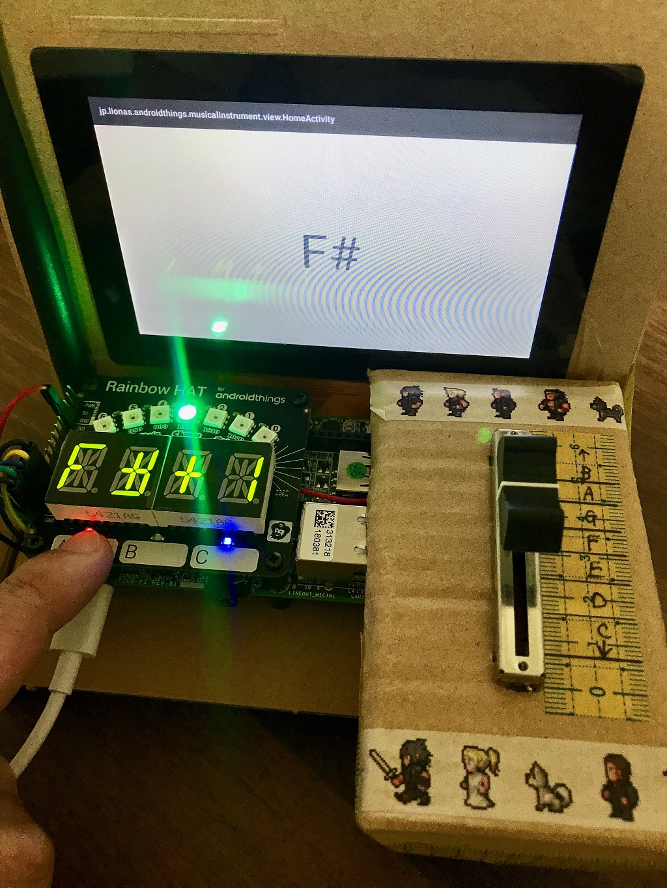
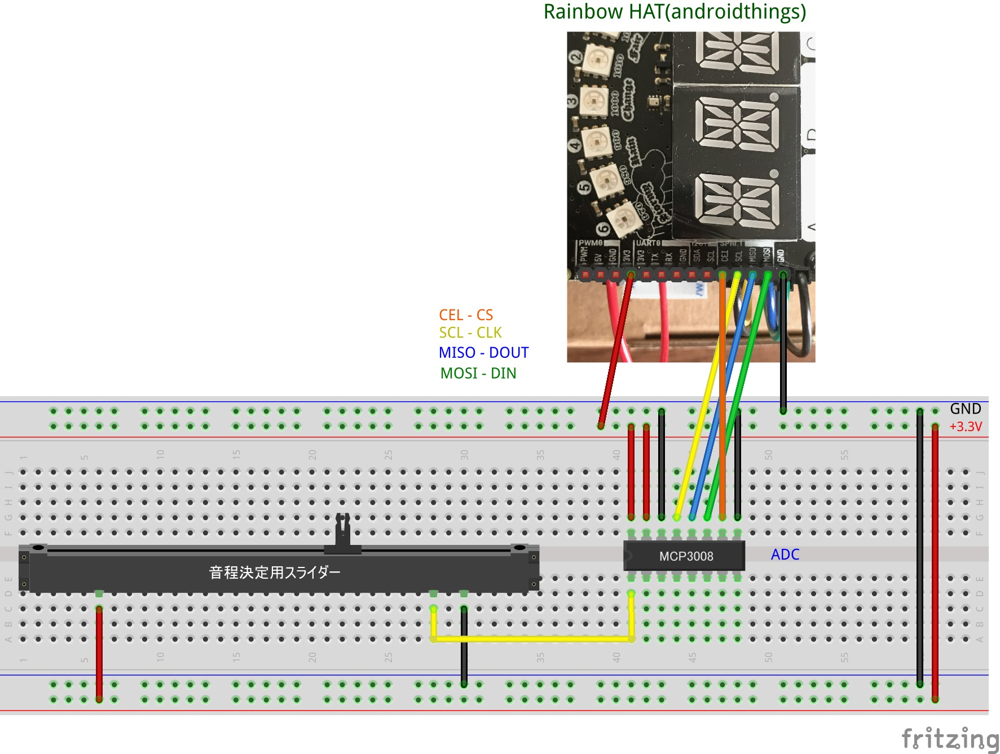
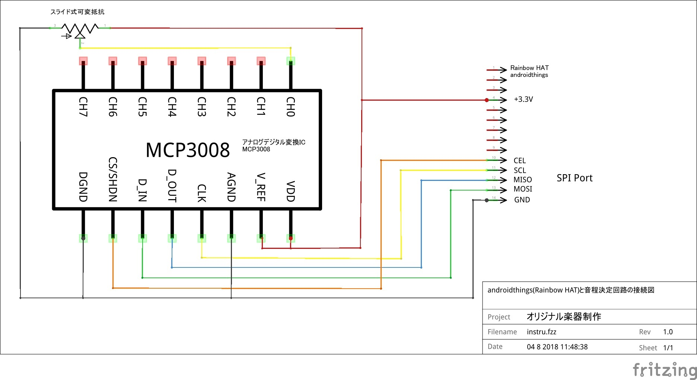

Electronic Musical Instrument sample for Android Things
============================================

This Android Things sample app demonstrates electronic musical instrument using MCP3008(8-Channel 10-Bit A/D Converters) and Rainbow HAT.

Screenshots
-----------

Pre-requisites
--------------

- NXP i.MX7D Starter Kit
- Android Studio 3.1.3+
- A/D converters([MCP3008][MCP3008]) x1
- Sliding variable resistor(potentiometer) x1
- breadboard x1
- jumper wires

Schematics
----------

Build and install
=================

On Android Studio, click on the "Run" button.

If you have everything set up correctly, the current value will be displayed to LCD display.

License
-------

Copyright 2018 Naoki Seto(@Lionas)

Licensed to the Apache Software Foundation (ASF) under one or more contributor
license agreements.  See the NOTICE file distributed with this work for
additional information regarding copyright ownership.  The ASF licenses this
file to you under the Apache License, Version 2.0 (the "License"); you may not
use this file except in compliance with the License.  You may obtain a copy of
the License at

  http://www.apache.org/licenses/LICENSE-2.0

Unless required by applicable law or agreed to in writing, software
distributed under the License is distributed on an "AS IS" BASIS, WITHOUT
WARRANTIES OR CONDITIONS OF ANY KIND, either express or implied.  See the
License for the specific language governing permissions and limitations under
the License.

[MCP3008]: https://www.digikey.jp/product-detail/ja/microchip-technology/MCP3008-I-P/MCP3008-I-P-ND/319422
